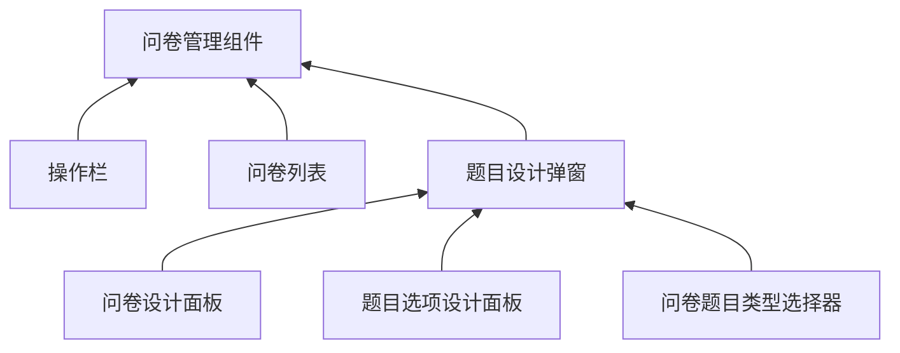

# QuestionnaireManager 问卷管理组件

## 1. 介绍 🤔

修改/添加/查询问卷的组件

## 2. 组件说明 🥳

### 2.1 Props

| 参数                | 说明             | 类型     | 默认值    | 引入版本 |
| ------------------- | ---------------- | -------- | --------- | -------- |
| data                | 问卷列表         | array    | null      | 0.1.0    |
| questionnaire       | 问卷             | object   | undefined | 0.1.0    |
| loading  | 加载状态 | boolean  | false     | 0.1.0    |
| saveFunc            | 保存问卷的方法   | function | null      | 0.1.0    |
| v-model:current-page | 当前页           | number   | 1         | 0.1.0    |
| v-model:show-dialog  | 编辑弹窗显隐控制 | boolean  | false     | 0.1.0    |
| pageSize            | 页码             | number   | 10        | 0.1.0    |

1. _currentPage_ 的改变可用 _watch_ 监听
2. saveFunc = PropType<(data: Questionnaire) => void>

### 2.2 Events

| 事件                 | 说明                       | 回调参数              | 引入版本 |
| -------------------- | -------------------------- | --------------------- | -------- |
| reload               | 希望重新获取数据           | 无                    | 0.1.0    |
| query                | 查询按钮点击触发           | data: string[] 关键字 | 0.1.0    |
| edit / view / remove | 编辑/查看/删除按钮点击触发 | id: string 问卷 id    | 0.1.0    |
| create               | 创建问卷按钮点击触发       | 无                    | 0.1.0    |
| batch-deletion       | 批量删除按钮点击触发       | string[] : id 集合    | 0.1.0    |

## 3. 业务实现 🤓

### 1. 组件树

1. 题目选项设计面板 [PanelTopicDesigner](./components/PanelTopicDesigner/README.md)
2. 问卷题目类型选择器 [TopicSelector](./components/TopicSelector/README.md)
3. 题目设计面板 [QuestionnaireDesigner](./components/QuestionnaireDesigner/README.md)
4. 题目设计弹窗 [DialogQuestionnaireDesigner](./components/DialogQuestionnaireDesigner/README.md)
5. 操作栏 [OperateBar](./components/OperateBar/README.md)
6. 问卷列表 [ListQuestionnaire](./components/ListQuestionnaire/README.md)
7. 问卷管理组件/本组件 [QuestionnaireManager](./README.md)

## 4. 测试计划 👻

1. 取消保存/查询时事件能否触发
2. 保存前处理问卷排序
