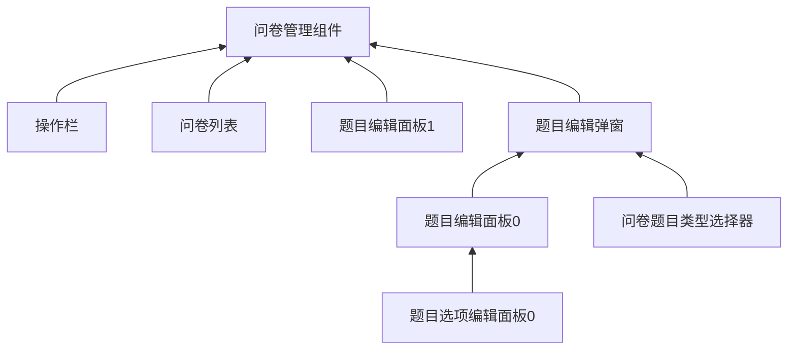

# QuestionnaireManager 问卷管理组件

## 1. 介绍 🤔

修改/添加/查询问卷的组件

## 2. 组件说明 🥳

### 2.1 Props

v-model = modelValue / v-model

| 参数                | 说明           | 类型   | 默认值 | 引入版本 |
| ------------------- | -------------- | ------ | ------ | -------- |
| data            | 问卷列表       | array  | null   | 0.1.0    |
| saveFunc            | 保存问卷的方法 | function | null   | 0.1.0    |
| v-model:currentPage | 当前页         | number | 1      | 0.1.0    |
| questionnaireType   | 问卷类型数组   | array  | []     | 0.1.0    |
| pageSize            | 页码           | number  | 10     | 0.1.0    |

1. _currentPage_ 的改变可用 _watch_ 监听
2. saveFunc = PropType<(data: Questionnaire) => void>

### 2.2 Events

| 事件   | 说明             | 回调参数            | 引入版本 |
| ------ | ---------------- | ------------------- | -------- |
| reload | 希望重新获取数据 | 无                  | 0.1.0    |
| query  | 查询按钮点击触发 | data: string 关键字 | 0.1.0    |

1. 由于把整个问卷列表对象都用 _v-model_ 绑定, 所以请一定实现 _reload_ 事件重新获取问卷列表

## 3. 业务实现 🤓

### 1. 组件树

* 即使不使用该组件, 也可以分别使用各个小组件重新组合
* 本项目只需用到 **radio** 和 **checkbox**

1. 题目选项编辑面板 [PanelTopicEditor](./PanelTopicEditor/README.md)
2. 问卷题目类型选择器 [ComponentSelector](./ComponentSelector/README.md)
3. 题目编辑面板 [PreviewOrEdit](./PanelTopicEditor/README.md)
4. 题目编辑弹窗 [DialogQuestionnaireEdit](./DialogQuestionnaireEdit/README.md)
5. 操作栏 [OperateBar](./OperateBar/README.md)
6. 问卷列表 [ListQuestionnaire](./ListQuestionnaire/README.md)
7. 问卷管理组件/本组件 [QuestionnaireManager](./README.md)

## 4. 测试计划 👻
